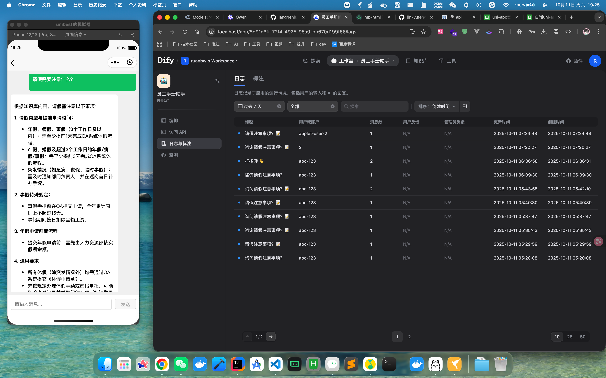

## llm-bestboot-applet

[配套后端 llm-bestboot](https://github.com/ruanbw/llm-bestboot)
[配套后后台 llm-bestboot-admin](https://github.com/ruanbw/llm-bestboot-admin)

## 功能

- llm-chat

## 预览

<video controls="controls" src='./preview/preview.mp4'></video>

## 其他

chat 返回的 md 内容采用 [mp-html](https://jin-yufeng.github.io/mp-html/#/) 解析

## 待修复

- ​小程序端 style 暂不支持 img 标签选择器，推荐使用 class 选择器，详情参考：https://uniapp.dcloud.net.cn/tutorial/migration-to-vue3.html#style​

@unibest
